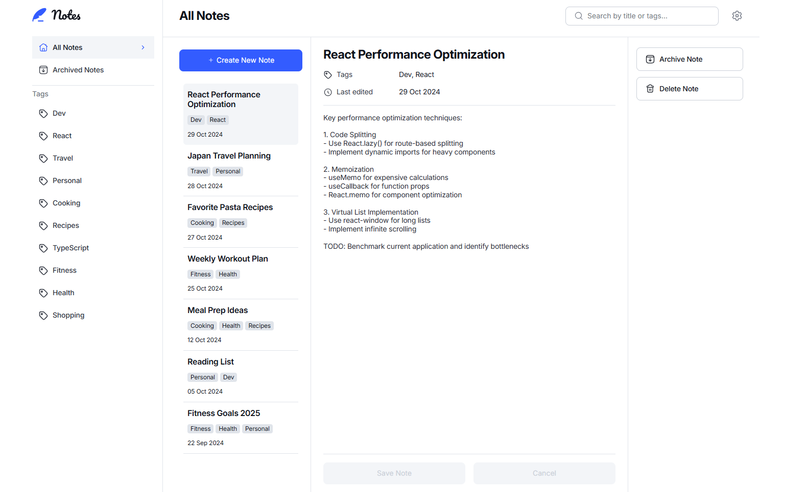

# Frontend Mentor - Note-taking web app solution

This is a solution to the [Note-taking web app challenge on Frontend Mentor](https://www.frontendmentor.io/challenges/note-taking-web-app-773r7bUfOG). Frontend Mentor challenges help you improve your coding skills by building realistic projects. 

## Table of contents

- [Overview](#overview)
  - [The challenge](#the-challenge)
  - [Screenshot](#screenshot)
  - [Links](#links)
- [My process](#my-process)
  - [Built with](#built-with)
  - [What I learned](#what-i-learned)
  - [Continued development](#continued-development)
- [Author](#author)
- [Acknowledgments](#acknowledgments)

**Note: Delete this note and update the table of contents based on what sections you keep.**

## Overview

### The challenge

Users should be able to:

- Create, read, update, and delete notes
- Archive notes
- View all their notes
- View all archived notes
- View notes with specific tags
- Search notes by title, tag, and content
- Select their color theme
- Select their font theme
- Receive validation messages if required form fields aren't completed
- Navigate the whole app and perform all actions using only their keyboard
- View the optimal layout for the interface depending on their device's screen size
- See hover and focus states for all interactive elements on the page
- **Bonus**: Save details to a database (build the project as a full-stack app)
- **Bonus**: Create an account, log in, change password (add user authentication to the full-stack app)
- **Bonus**: Reset their password (add password reset to the full-stack app)

### Screenshot

### Links

- Solution URL: [Add solution URL here](https://github.com/DenRisk/fm-notes)
- Live Site URL: [Add live site URL here](https://denrisk.github.io/fm-notes/)

## My process

### Built with

- Semantic HTML5 markup
- CSS custom properties
- Flexbox
- CSS Grid
- Mobile-first workflow
- [React](https://react.dev/)

### What I learned

I used this project to refresh and improve my React skills. I used Context as state management and custom hooks to control functions. I also created an Icon.tsx that listens to the ID of the icon to be displayed. Previously, I always included an icon externally as an  tag. In addition, the challenge was to create an application that is not scrollable and differs greatly from the structure in the mobile design.

### Continued development

Further work can be done on the bonus tasks in the future. This includes, above all, a login. The localStorage can also be used as long as no database exists.

I would also like to work on the toasts, as an array is currently being rendered and displays all toasts in the array. If a new toast is added, the array is rendered again. The duration of the first toast content is thus reset. Accordingly, all toasts only disappear when the last added toast expires. I would like to make these independent of each other and not iterate over an array.

## Author

- GitHub - [DenRisk](https://github.com/DenRisk)
- Frontend Mentor - [DenRisk](https://www.frontendmentor.io/profile/DenRisk)

## Acknowledgments

I realized that it is important to plan the project before the start. This includes the structure and also the state management. This would have saved me a lot of time.